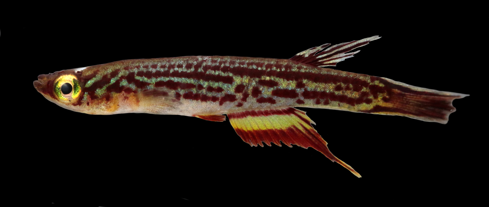
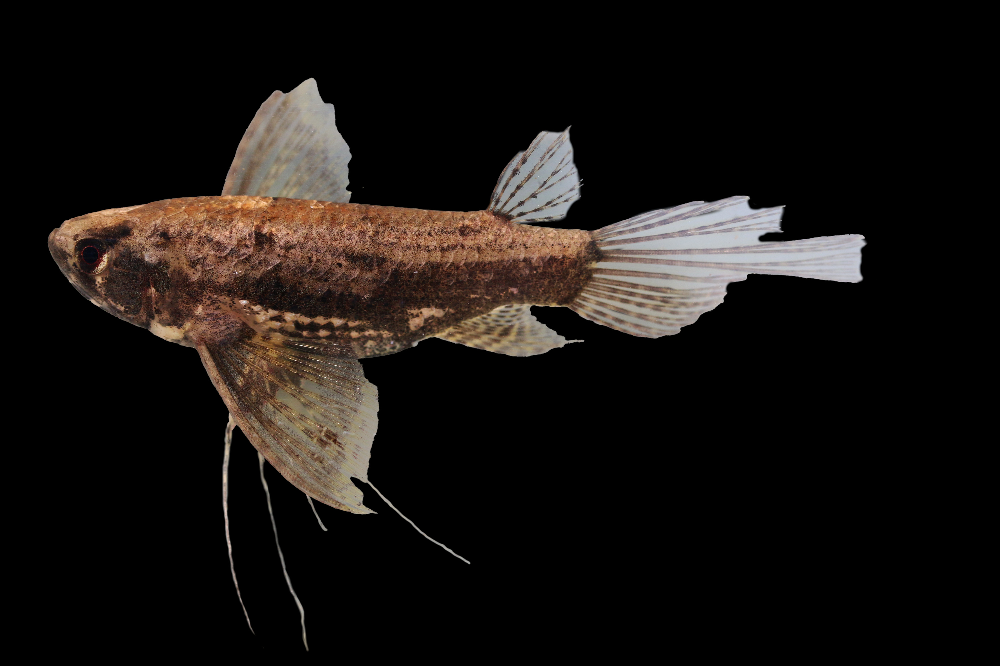
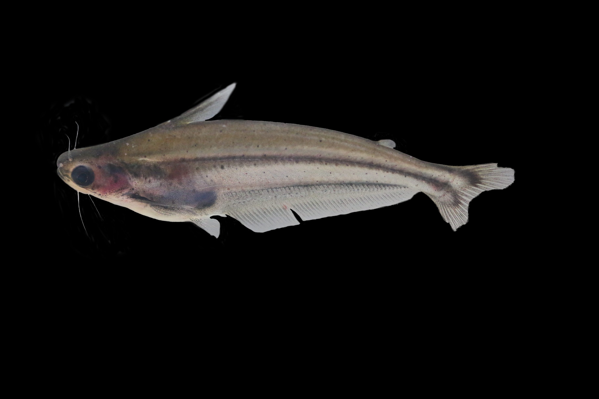
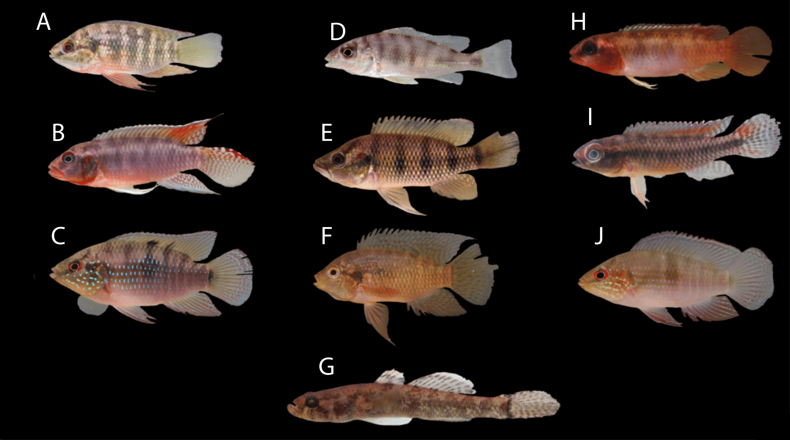
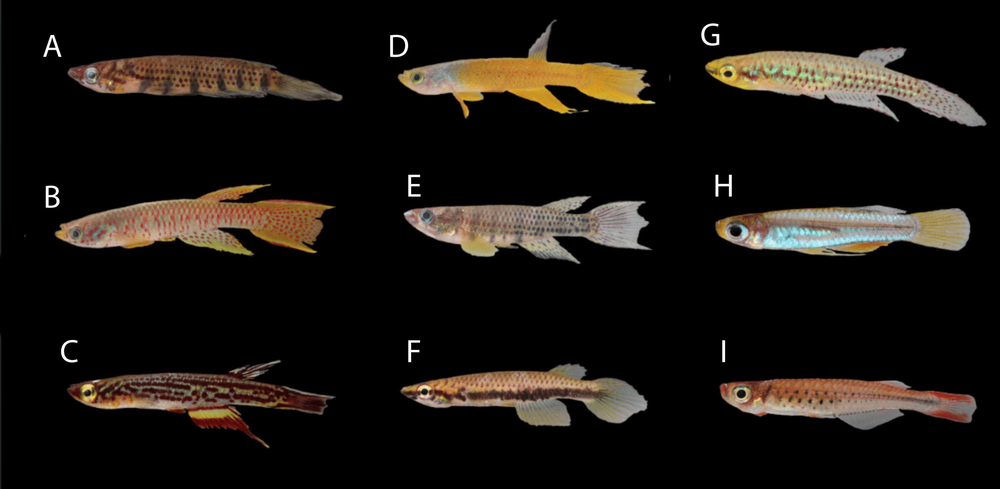
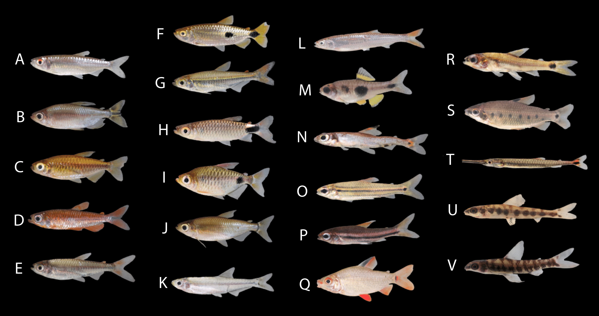

<!DOCTYPE html>
<html lang="en">
<head>
  <meta charset="UTF-8">
  <meta name="viewport" content="width=device-width, initial-scale=1.0">
  <title>Specimens Studios Fish Editing Services</title>
  
</head>
<body>
  <header>
    <h1>Specimens Studios Fish Editing Services</h1>
    
Professional editing and background removal for ichthyology images

  </header>

  <section>
    <h2>What I Do</h2>
    
I specialize in editing fish specimen images for scientific publication. I provide high-quality edits tailored to ichthyologists and taxonomists; contact me if you need clean background removal, subtle enhancement, or full figure assembly for journals.

    <ul>
      <li>Background removal (white, black, or transparent)</li>
      <li>Image enhancement (color, contrast, clarity)</li>
      <li>Figure plate assembly</li>
      <li>Scientific formatting (TIFFs, scale bars, etc.)</li>
    </ul>
    <a class="button" href="#contact">Contact Me</a>
  </section>

  <section>
    <h2>Sample Portfolio</h2>
    

      
      
      
      
    

  </section>

  <section>
    <h2>Finished Plates</h2>
    

      
      
      
    

  </section>

  <section id="contact">
    <h2>Get in Touch</h2>
    
Interested in working together? I'd love to hear from you! Email me at <strong>julia@specimensstudio.com</strong> or send me a message below:

    <form action="https://formspree.io/f/mrblkyer" method="POST">
      <input type="hidden" name="_next" value="https://wmanningcat.github.io/Specimens-Studios/thankyou.html">
      <label>Your Name: <input type="text" name="name" required></label>
      <label>Your Email: <input type="email" name="email" required></label>
      <label>Message: <textarea name="message" rows="5" required></textarea></label>
      <button class="button" type="submit">Send Message</button>
    </form>
  </section>

  <footer>
    &copy; 2025 Julia Manning. Fish photo editing by scientists, for scientists.
  </footer>
</body>
</html>

